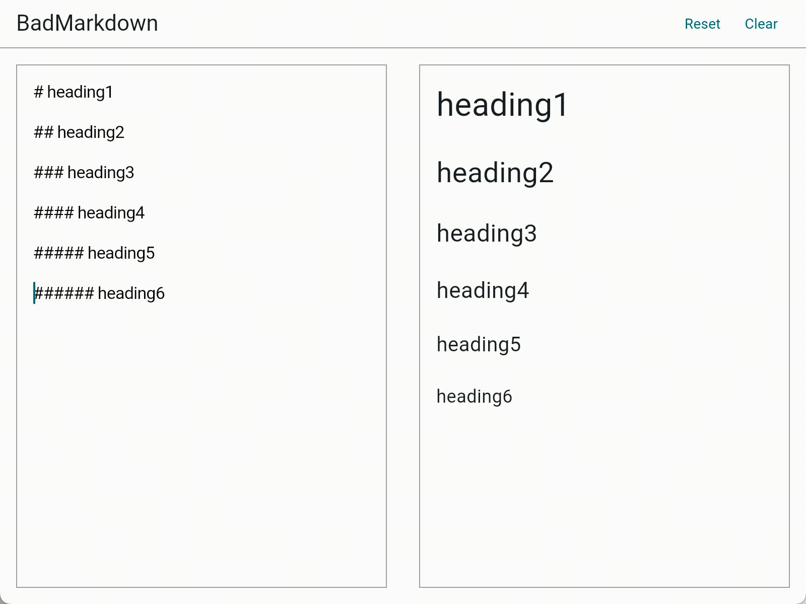
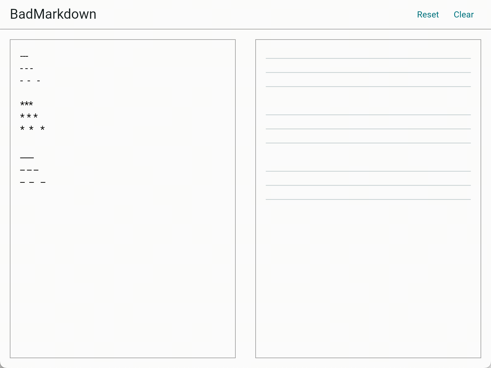
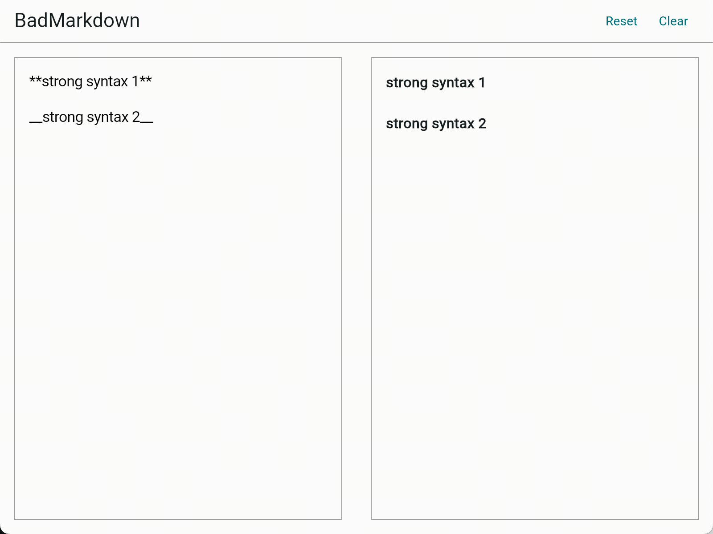
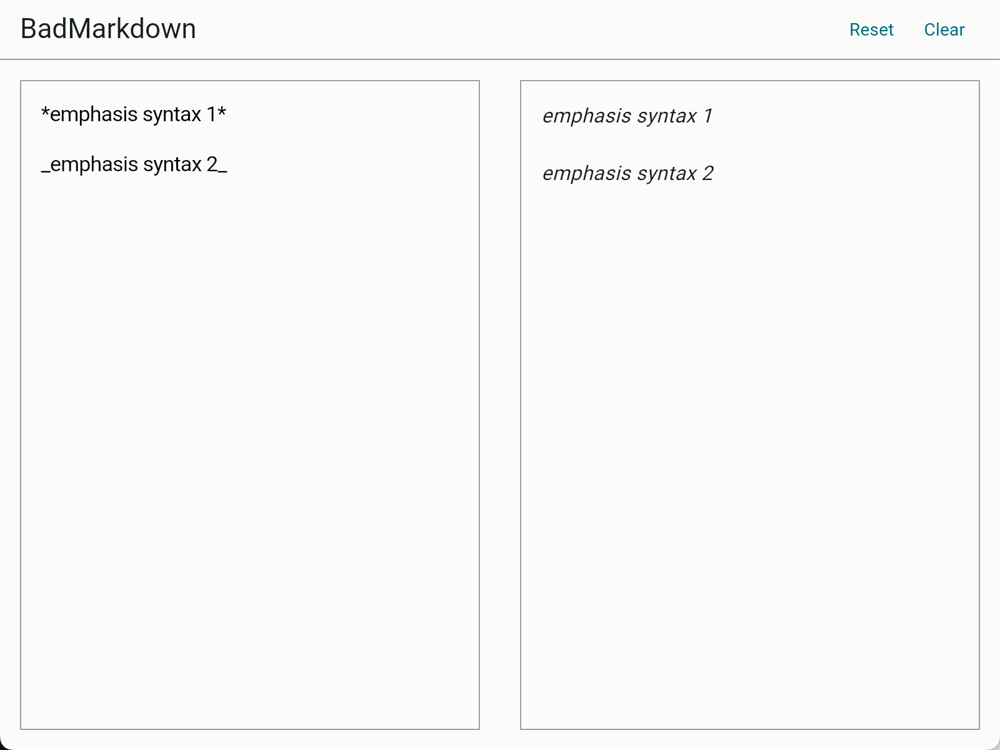
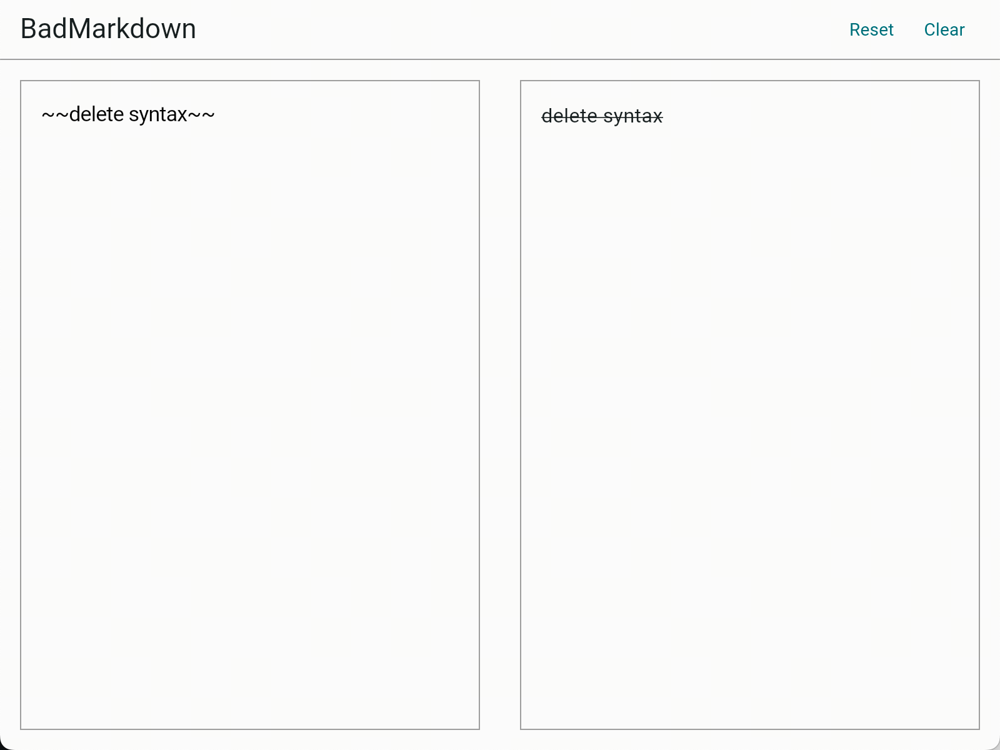

# BadMarkdown

> It can indeed render markdown, but not all Markdown formats can be rendered by it.

## Support Matrix

### Block-level

| Type                               | Support |
|------------------------------------|---------|
| [heading](#Heading)                | ✅       |
| blockquote                         | 🔨      |
| codeblock                          | ⏳       |
| unordered-list-item                | ⏳       |
| ordered-list-item                  | ⏳       |
| table                              | ⏳       |
| [horizontal-rule](#HorizontalRule) | ✅       |
| checkbox                           | ⏳       |

### Inline-level

| Type                  | Support |
|-----------------------|---------|
| [strong](#Strong)     | ✅       |
| [emphasis](#Emphasis) | ✅       |
| [delete](#Delete)     | ✅       |
| link                  | ⏳       |
| image                 | ⏳       |
| codespan              | ⏳       |

## Heading

### Supported syntax

```text
# heading level 1

## heading level 2

### heading level 3

#### heading level 4

##### heading level 5

###### heading level 6
```

### Default Style



## Blockquote

WIP

## Codeblock

WIP

## UnorderedListItem

WIP

## OrderedListItem

WIP

## Table

WIP

## HorizontalRule

### Supported syntax

```text
---
- - -
-  -   -

***
* * *
*  *   *

___
_ _ _
_  _   _
```

### Default Style



## Checkbox

WIP

## Strong

### Supported syntax

```text
**strong syntax 1**

__strong syntax 2__
```

### Default Style



## Emphasis

### Supported syntax

```text
*emphasis syntax 1*

_emphasis syntax 2_
```

### Default Style



## Delete

### Supported syntax

```text
~~delete syntax~~
```

### Default Style



## Link

WIP

## Image

WIP

## Codespan

WIP